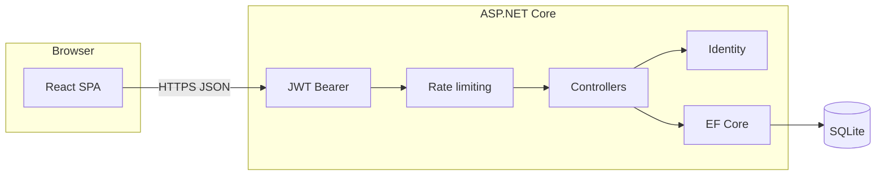

# Snippet Manager

A **full-stack social-style code snippet feed**: post syntax-highlighted snippets with tags, browse an infinite-scrolling timeline, favorite posts, and manage your profile. Built to demonstrate **secure REST APIs**, **JWT authentication with roles**, and a **polished React SPA** wired to a real database.

---

## Why this project

| What it shows | How |
|-----------------|-----|
| **Backend API design** | Versioned REST resources, pagination headers, conflict handling, Swagger/OpenAPI |
| **AuthN / AuthZ** | ASP.NET Core Identity, JWT bearer tokens, role-based authorization (`Admin` vs user) |
| **Data layer** | EF Core migrations, SQLite for local/dev, relational modeling (users, snippets, tags, favorites, join tables) |
| **Frontend architecture** | React 19 + TypeScript, client-side routing, context-based auth, API clients with env-based base URL |
| **UX polish** | Toast notifications, SweetAlert2 confirmations themed to the app, responsive layout, mock-feed mode for offline demos |

---

## Features

### Feed & snippets

- **Public timeline** of snippets (newest first) with **infinite scroll** and server-backed pagination.
- **Compose** posts with title, code body, language, and **multiple tags** from a global catalog.
- **Copy-to-clipboard** on cards; **delete** for owners; **admins can delete any snippet** (mirrored in API and UI).
- Optional **`VITE_USE_MOCK_FEED`** for a client-only mock dataset when the API is unavailable.

### Accounts & security

- **Register / login**; passwords validated with Identity policies (length, upper/lower/digit).
- **JWT access tokens** with configurable expiry; **roles** embedded in the token and reflected in the login response.
- **Client-side `Admin` UI** is driven by **roles parsed from the JWT payload** (not a separately editable `roles` field in storage), so the SPA stays aligned with what the API enforces.
- **Change password** for signed-in users (authenticated endpoint).

### Profile

- **My snippets** — snippets authored by the current user (JWT-scoped `GET`).
- **Favorites** — add/remove favorites; list is tied to the signed-in user.
- **Settings** — account-related actions when the live API is enabled.

### Admin dashboard (`/admin`)

- **User directory** — paginated table of users with **total user count**; **Admin-only** API (`GET /api/users`).
- **Global tags** — create, rename, and delete tags. **Deleting a tag** removes it from the join table for any snippets that used it, then deletes the tag (no manual “detach everywhere” step).
- **SweetAlert2** confirmations for destructive actions, styled to match the app.

### API hardening (non-Development)

- **Rate limiting** on write/auth routes and a global per-IP budget (see `Program.cs`).
- **CORS** allowlist required via configuration (no silent default in production).

---

## Tech stack

| Layer | Technologies |
|--------|----------------|
| **API** | .NET 10, ASP.NET Core, EF Core 10, SQLite, Swashbuckle (Swagger), JWT Bearer |
| **Auth** | ASP.NET Core Identity (int keys), password policies, role claims in JWT |
| **UI** | React 19, TypeScript 5.9, Vite 8, React Router 7 |
| **UX** | SweetAlert2, custom CSS design system (`App.css`) |
| **Tests** | `backend.tests` — integration tests against the in-process API (`WebApplicationFactory`) |



---

## Getting started

### Prerequisites

- [.NET 10 SDK](https://dotnet.microsoft.com/download)
- [Node.js](https://nodejs.org/) (LTS)

### 1. Clone and configure JWT (required)

The API **refuses to start** without a signing key (minimum **32 characters**). For local development, from the `backend` folder:

```bash
cd backend
dotnet user-secrets set "Jwt:Key" "<your-secret-at-least-32-chars>"
```

You can also set the environment variable **`Jwt__Key`**. See [Configuration](#configuration-and-secrets).

### 2. Database

```bash
cd backend
dotnet restore
dotnet ef database update
```

If `dotnet ef` is not found: `dotnet tool install --global dotnet-ef`.

### 3. Run the API

```bash
cd backend
dotnet run
```

- Default profile: **http://localhost:5090**
- Swagger (Development): **http://localhost:5090/swagger**

The SQLite file is created relative to the process working directory (typically **`backend/app.db`** when you run from `backend/`). Migration notes: [backend/Migrations/README.md](backend/Migrations/README.md).

### 4. Run the frontend

```bash
cd frontend
npm install
npm run dev
```

- UI: **http://localhost:5173**
- Optional: copy `frontend/.env.example` to `.env` and set **`VITE_API_URL`** if the API is not on the default port.

CORS on the API must include the frontend origin (see `appsettings.Development.json` / env `Cors__AllowedOrigins__0`).

### 5. Development admin user (optional)

In **Development**, the API can seed an **`Admin`** user when `AdminSeed:Password` is set (for example in `appsettings.Development.json` or `AdminSeed__Password`). The admin email/username are configurable (`AdminSeed:Email`, `AdminSeed:Username`). On each startup, the seeded password is synced for that account so local credentials stay predictable.

---

## API overview

Base path: **`/api`**. Highlights:

| Area | Routes (examples) | Notes |
|------|-------------------|--------|
| **Auth** | `POST /api/auth/register`, `POST /api/auth/login`, `POST /api/auth/change-password` | JWT + roles in response |
| **Snippets** | `GET /api/snippets`, `GET /api/snippets/me`, `POST /api/snippets`, `DELETE /api/snippets/{id}` | Deletes: owner **or** `Admin` |
| **Tags** | `GET /api/tags`, `POST/PUT/DELETE` (admin) | Writes require `Admin`; delete cascades off snippets |
| **Snippet tags** | `GET/POST/DELETE` under `/api/snippets/{id}/tags` | Link snippets to catalog tags |
| **Favorites** | User-scoped favorites endpoints | Composite keys on favorites |
| **Users** | `GET /api/users` (admin) | Paginated + `X-Total-Count` |

List endpoints support pagination query params and return **`X-Total-Count`**, **`X-Page`**, **`X-Page-Size`** headers.

Use **Swagger** in Development to explore schemas and try authenticated calls (Authorize with `Bearer <token>`).

---

## Configuration and secrets

| Setting | Purpose |
|---------|---------|
| `Jwt__Key` | **Required** — symmetric key for signing JWTs (≥ 32 chars) |
| `ConnectionStrings__DefaultConnection` | **Required** — e.g. `Data Source=app.db` |
| `Cors__AllowedOrigins__*` | **Required** — one or more frontend origins |
| `AdminSeed__Email`, `AdminSeed__Username`, `AdminSeed__Password` | Optional — Development admin seed |

**Do not commit** production secrets. Prefer environment variables or a host secret store in deployment.

---

## Testing

```bash
dotnet test backend.tests/backend.tests.csproj
```

Integration tests spin up the API in-process with an isolated temp SQLite database and exercise auth, snippets, tags, favorites, and admin-only routes.

---

## Project layout

```
snippet-manager/
├── backend/           # ASP.NET Core API, EF migrations, SQLite
├── backend.tests/     # Integration tests (WebApplicationFactory)
└── frontend/          # Vite + React + TypeScript SPA
```

---