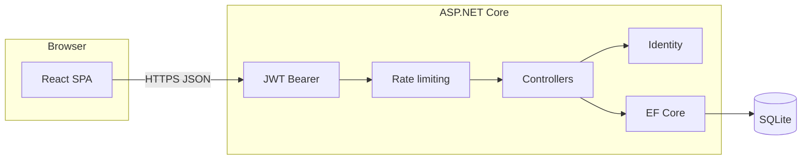

# Snippet Manager

A full-stack web app for sharing and managing code snippets. **ASP.NET Core 10 + EF Core** API, **React 19 + TypeScript** SPA, **JWT authentication with role-based authorization**, and a comprehensive **Playwright end-to-end** test suite alongside **xUnit API integration tests**.

> **Live demo:** _coming soon_ &nbsp;·&nbsp; **API docs (local):** http://localhost:5090/swagger

---

## At a glance

| Area | What's shown |
|---|---|
| **Backend** | ASP.NET Core 10, EF Core, ASP.NET Core Identity, JWT bearer auth, rate limiting, CORS configuration, OpenAPI/Swagger |
| **Frontend** | React 19, TypeScript, React Router, context-based auth, role-aware UI driven by JWT claims |
| **Data** | SQLite + EF Core migrations, relational modeling (users, snippets, tags, favorites, many-to-many join tables) |
| **Testing** | **5 Playwright e2e specs** (Chromium / Firefox / WebKit) with shared helpers, `storageState` auth, API-driven setup/cleanup. **xUnit integration tests** running against an in-process API with isolated DB |
| **DX** | Vite, hot reload, strict TypeScript, role-based protected routes, optional mock-feed mode |

---

## Why I built it

The goal was a project that exercises the full lifecycle of a real web application — not just CRUD. Concretely:

- Designing a **secure REST API** with proper authentication, authorization, rate limiting, and CORS configuration.
- Building a **React SPA** that respects backend authority (role checks driven by JWT claims, not client-side state).
- Writing **realistic end-to-end tests** with isolated state, deterministic data setup via the API, and proper cleanup — patterns I'd expect to use on a production team.

---

## Features

### Public feed

- Infinite-scroll timeline of snippets with server-backed pagination (`X-Total-Count`, `X-Page` headers).
- Compose posts with title, code, language, and multiple tags from a global catalog.
- Copy-to-clipboard, owner-only delete, **admins can delete any snippet**.

### Authentication & authorization

- Register / sign in with **ASP.NET Core Identity** (password policy enforced).
- **JWT access tokens** with configurable expiry; roles embedded in the token.
- The SPA parses JWT claims to drive what the user can see — there is no separate "roles" field in storage that the client can tamper with.
- Protected routes (`/profile`, `/admin`) redirect unauthenticated users to sign-in and return them after.
- **Change password** endpoint behind `[Authorize]`.

### Profile

- **My snippets** — JWT-scoped, only your posts.
- **Favorites** — heart snippets from the feed; favorites are persisted server-side per user.
- **Settings** — current account info; passwords are changed via authenticated API.

### Admin dashboard

- **Users table** — paginated, with total user count. Owners can promote users to admin.
- **Global tags** — create, rename, delete. Deleting a tag also unlinks it from any snippets that reference it.
- All destructive actions confirmed via styled SweetAlert2 modals.

### Backend hardening

- **Rate limiting** — separate buckets for global, write, and register endpoints (per-user when authenticated, per-IP when not).
- **CORS** — allowlist required via config; refuses to start without explicit origins outside development.
- **JWT key validation** — refuses to start without a key of at least 32 chars.

---

## Testing

This is the area I spent the most deliberate effort on, because reliable end-to-end tests are usually the bar that separates "works on my machine" from "ready to ship."

### Playwright e2e suite (`frontend/tests/`)

```
tests/
├── auth.setup.ts             # signs in once per role, saves browser context
├── auth.spec.ts              # sign-in, registration validation
├── access-control.spec.ts    # route guards for guest/user/admin
├── feed.spec.ts              # public feed, create, delete, favorites
├── profile.spec.ts           # my snippets, favorites, settings
├── admin.spec.ts             # users CRUD, tags CRUD
└── helpers/                  # api-config, auth-helpers, snippet-helpers, tag-helpers
```

Highlights:

- **`storageState` per role** — one UI sign-in in setup; every spec re-uses the saved browser context. Zero login calls per test.
- **API-driven arrange, UI-driven act/assert** — test data is seeded via authenticated `request.post(...)` calls (typed helpers), then verified through the UI the way a real user would see it.
- **Deterministic cleanup** — describe-scoped `afterEach` blocks delete API-created rows so a failing test doesn't poison the next run.
- **Locator strategy** — `getByRole` with accessible names (`region`, `listitem`, `cell`, `row`, `heading`) for resilient selectors. No `data-testid`, no CSS classes.
- **Network synchronization** — `page.waitForResponse(...)` with precise status codes (e.g. `201` for create, `204` for promote) before navigation, so tests don't race the server.
- **Cross-browser** — runs against **Chromium, Firefox, and WebKit**.

Run it:

```bash
cd frontend
npm install
npx playwright install
npx playwright test
```

### Backend integration tests (`backend.tests/`)

xUnit + `WebApplicationFactory` — spins up the API in-process with an isolated temp SQLite database and exercises auth, snippets, tags, favorites, and admin-only routes end-to-end.

```bash
dotnet test backend.tests/backend.tests.csproj
```

---

## Tech stack

| Layer | Stack |
|---|---|
| **API** | .NET 10, ASP.NET Core, EF Core 10, SQLite, JWT Bearer, Swashbuckle |
| **Auth** | ASP.NET Core Identity (int keys), role claims in JWT |
| **UI** | React 19, TypeScript 5.9, Vite 8, React Router 7 |
| **UX** | SweetAlert2, custom CSS design system |
| **Tests** | Playwright (TypeScript), xUnit + `WebApplicationFactory` |



---

## Running locally

### Prerequisites

- [.NET 10 SDK](https://dotnet.microsoft.com/download)
- [Node.js](https://nodejs.org/) (LTS)

### 1. Configure the JWT signing key

The API refuses to start without a key of at least 32 characters. From `backend/`:

```bash
dotnet user-secrets set "Jwt:Key" "<your-secret-at-least-32-chars>"
```

Or set the env var `Jwt__Key`.

### 2. Apply migrations and run the API

```bash
cd backend
dotnet restore
dotnet ef database update
dotnet run
```

- API: http://localhost:5090
- Swagger (Development): http://localhost:5090/swagger

If `dotnet ef` is missing: `dotnet tool install --global dotnet-ef`.

### 3. Run the frontend

```bash
cd frontend
npm install
npm run dev
```

- UI: http://localhost:5173
- Optional `frontend/.env` with `VITE_API_URL` if the API isn't on the default port.

Make sure the API's CORS allowlist includes `http://localhost:5173` (it does in `appsettings.Development.json`).

### 4. Optional: seed an admin

In Development, set `AdminSeed:Email`, `AdminSeed:Username`, and `AdminSeed:Password` to have the API provision an admin user on startup. The seed password is re-applied on each run, so local credentials stay predictable.

### 5. Running the test suite

```bash
# Playwright (frontend e2e)
cd frontend
npx playwright install   # one-time
npx playwright test

# xUnit (backend integration)
cd ..
dotnet test backend.tests/backend.tests.csproj
```

The Playwright suite expects the API to be running. Start it with the `testing` launch profile to disable rate limiting for the test run:

```bash
cd backend
dotnet run --launch-profile testing
```

---

## API surface

Base path: **`/api`**. List endpoints return `X-Total-Count`, `X-Page`, and `X-Page-Size` headers.

| Area | Routes (examples) | Notes |
|---|---|---|
| Auth | `POST /api/auth/register`, `POST /api/auth/login`, `POST /api/auth/change-password` | JWT + roles in the response |
| Snippets | `GET /api/snippets`, `GET /api/snippets/me`, `POST /api/snippets`, `DELETE /api/snippets/{id}` | Delete: owner **or** `Admin` |
| Tags | `GET /api/tags`, `POST/PUT/DELETE` (admin) | Writes require `Admin`; delete cascades off snippets |
| Snippet tags | `GET/POST/DELETE /api/snippets/{id}/tags` | Many-to-many join |
| Favorites | User-scoped favorites endpoints | Composite key |
| Users | `GET /api/users` (admin), `POST /api/users/{id}/admin` (owner), `DELETE /api/users/{id}` (admin) | Paginated |

Use Swagger in Development to explore schemas and try authenticated calls (`Authorize` → `Bearer <token>`).

---

## Configuration

| Setting | Purpose |
|---|---|
| `Jwt__Key` | **Required** — symmetric key for signing JWTs (≥ 32 chars) |
| `ConnectionStrings__DefaultConnection` | **Required** — e.g. `Data Source=app.db` |
| `Cors__AllowedOrigins__*` | **Required** outside development — frontend origins |
| `AdminSeed__Email`, `AdminSeed__Username`, `AdminSeed__Password` | Optional — Development admin seed |

Do not commit production secrets. Prefer environment variables or a host secret store in deployment.

---

## Project layout

```
snippet-manager/
├── backend/           # ASP.NET Core API, EF migrations, SQLite
├── backend.tests/     # xUnit integration tests (in-process API)
└── frontend/          # Vite + React + TypeScript SPA
    └── tests/         # Playwright e2e suite
```

---

## What I'd add next

- Deploy: API on Azure App Service, frontend on Vercel, GitHub Actions running both test suites on every push.
- OAuth providers (GitHub, Google) alongside the existing email/password flow.
- Syntax highlighting on snippet cards.
- Observability — structured logs + a small request-trace correlation id end-to-end.
